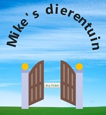

# The-ZOO

Demo: 

An introduction and exercise in Object oriented programming

1. Think of zoo data structure on paper -Done-

2. Use JS to script the data structure into classes -Done-

3. Use JS to fill the zoo with random animals -Done-

4. Create a button to call statistics on the zoo -Done-

5. Randomize and fill the subclass properties (name, color etc..) -Done-

6. Make a function to autocreate a name upon creating/pushing a new animal -Done-

7. Create and use a Helper.js file to use with general functions -DONE-

8. Create HTML frontpage with CSS pre-processor (SASS) -DONE-

9. Add ticketsale to frontpage -DONE-